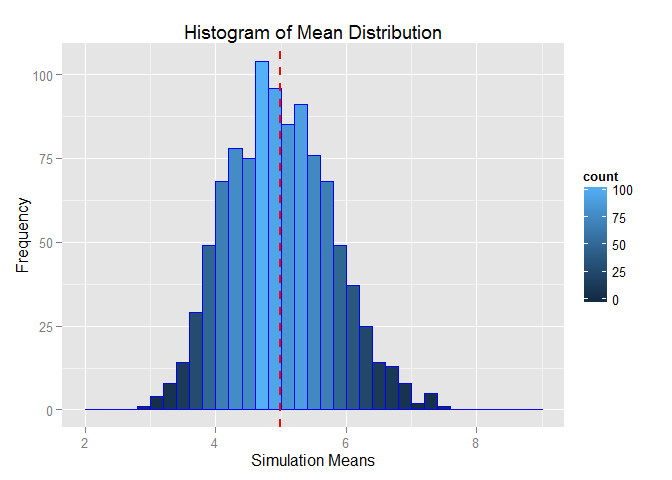
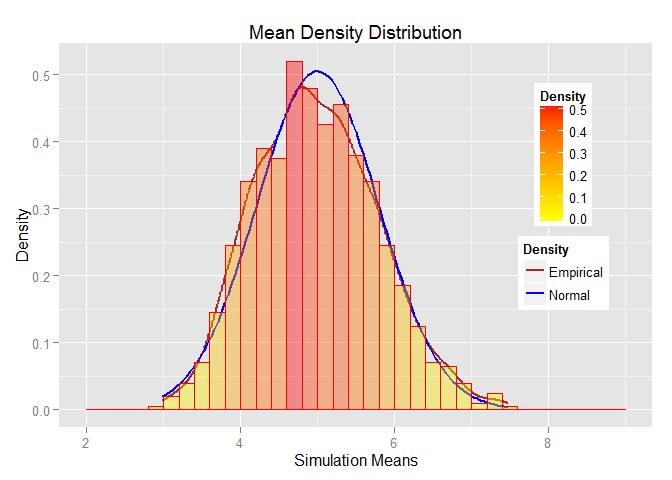
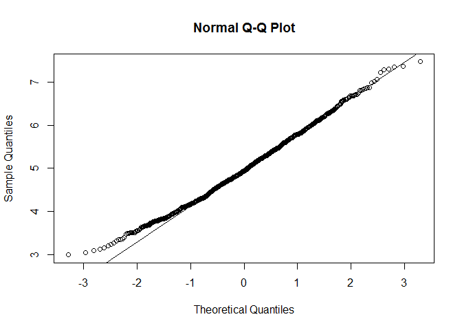

Overview:
---------

This project investigates the Exponential distribution in R and compares
it with the Central Limit Theorem. The mean of the Exponential
distribution is $\\frac{1}{\\lambda}$ and the standard deviation is also
$\\frac{1}{\\lambda}$. A thousand simulations of the distribution of 40
exponentials would be investigated.

Simulations:
------------

The exponential distribution can be simulated in R with
`rexp(n, lambda)`, where `lambda` is the rate parameter and `n` is the
number of observations. For the purpose of all the simulations in this
project, value of `lambda` is set to `0.2`.  
First we load the `ggplot2` plotting library.

    library(ggplot2)

We then initialize the simulation controlling variables.

    noSim <- 1000
    sampSize <- 40
    lambda <- 0.2

Set the seed of the Random Number Generator, so that the analysis is
reproducible.

    set.seed(3)

Create a matrix with thousand rows corresponding to 1000 simulations and
forty columns corresponding to each of 40 random simulations.

    simulationMatrix <- matrix(rexp(n = noSim * sampSize, rate = lambda), noSim, sampSize)

Create a vector of thousand rows containing the mean of each row of the
`simulationMatrix`.

    simulationMean <- rowMeans(simulationMatrix)

Create a data frame containing the whole data.

    simulationData <- data.frame(cbind(simulationMatrix, simulationMean))

We plot the simulation data to visualize it.

    ggplot(data = simulationData, aes(simulationData$simulationMean)) + 
      geom_histogram(breaks = seq(2, 9, by = 0.2), col = "blue", aes(fill = ..count..)) + 
      labs(title = "Histogram of Mean Distribution", x = "Simulation Means", y = "Frequency") + 
      geom_vline(aes(xintercept=mean(simulationData$simulationMean)), color="red", 
                 linetype="dashed", size=1)

Sample Mean Versus Theoretical Mean:
------------------------------------

The actual mean of the simulated mean sample data is 4.9866197,
calculated by:

    actualMean <- mean(simulationMean)

And the theoretical mean is 5, calculated by:

    theoreticalMean <- (1 / lambda)

Thus, we can see that the actual mean of the simulated mean sample data
is very close to the theoretical mean of original data distribution.

Sample Variance Versus Theoretical Variance:
--------------------------------------------

The actual variance of the simulated mean sample data is 0.6257575,
calculated by:

    actualVariance <- var(simulationMean)

And the theoretical variance is 0.625, calculated by:

    theoreticalVariance <- ((1 / lambda) ^ 2) / sampSize

Thus, we can see that the actual variance of the simulated mean sample
data is very close to the theoretical variance of original data
distribution.

Distribution:
-------------

To prove that the simulated mean sample data approximately follows the
Normal distribution, we perform the following three steps:

#### Step 1: Create an approximate normal distribution and see how the sample data alligns with it.

    qplot(simulationMean, geom = 'blank') + 
      geom_line(aes(y=..density.., colour='Empirical'), stat='density', size=1) + 
      stat_function(fun=dnorm, args=list(mean=(1/lambda), sd=((1/lambda)/sqrt(sampSize))), 
                    aes(colour='Normal'), size=1) + 
      geom_histogram(aes(y=..density.., fill=..density..), alpha=0.4, 
                     breaks = seq(2, 9, by = 0.2), col='red') + 
      scale_fill_gradient("Density", low = "yellow", high = "red") + 
      scale_color_manual(name='Density', values=c('brown', 'blue')) + 
      theme(legend.position = c(0.85, 0.60)) + 
      labs(title = "Mean Density Distribution", x = "Simulation Means", y = "Density")

From above histogram, the simulated mean sample data can be adequately
approximated with the normal distribution.

#### Step 2: Compare the 95% confidence intervals of the simulated mean sample data and the theoretical normally distributed data.

    actualConfInterval <- actualMean+c(-1,1)*1.96*sqrt(actualVariance)/sqrt(sampSize)
    theoreticalConfInterval <- theoreticalMean+c(-1,1)*1.96*
      sqrt(theoreticalVariance)/sqrt(sampSize)

Actual 95% confidence interval is \[4.7414712, 5.2317681\] and
Theoretical 95% confidence interval is \[4.755, 5.245\] and we see that
both of them are approximately same.

#### Step 3: q-q Plot for Qunatiles.

    qqnorm(simulationMean)
    qqline(simulationMean)

The actual quantiles also closely match the theoretical quantiles, hence
the above three steps prove that the distribution is approximately
normal.
