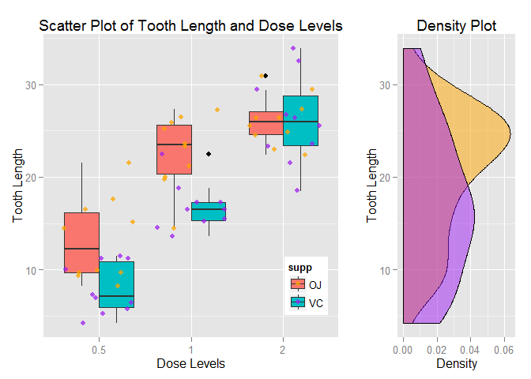

Description Of The Data Set:
----------------------------

The response is the length of odontoblasts (teeth) in each of 10 guinea
pigs at each of three dose levels of Vitamin C (0.5, 1, and 2 mg) with
each of two delivery methods (orange juice or ascorbic acid).  
Load the `ggplot2` and `datasets` libraries and the data set in the
workspace.

    library(ggplot2)
    library(datasets)
    library(gridExtra)
    data(ToothGrowth)
    attach(ToothGrowth)

Convert `dose` to factor.

    ToothGrowth$dose <- factor(ToothGrowth$dose)

Get the format of the data set.

    str(ToothGrowth)

    ## 'data.frame':    60 obs. of  3 variables:
    ##  $ len : num  4.2 11.5 7.3 5.8 6.4 10 11.2 11.2 5.2 7 ...
    ##  $ supp: Factor w/ 2 levels "OJ","VC": 2 2 2 2 2 2 2 2 2 2 ...
    ##  $ dose: Factor w/ 3 levels "0.5","1","2": 1 1 1 1 1 1 1 1 1 1 ...

Exploratory Data Analysis:
--------------------------

Scatterplot along with box plot and density plot for comparison between
`Tooth Lengths` with respect to `Dose Levels` and `Delivery Methods`.  
Following code gives scatterplot and box plot of `Dose Levels` and
`Tooth Lengths` variables.

    set.seed(123)
    scatter <- ggplot(ToothGrowth,aes(dose,len)) + 
      geom_boxplot(aes(fill=supp)) + 
      geom_jitter(alpha=I(3/4),aes(color=supp)) + 
      scale_color_manual(values=c("orange","purple")) + 
      theme(legend.position=c(1,0.3),legend.justification=c(1,1)) + 
      labs(title="Scatter Plot of Tooth Length and Dose Levels",x="Dose Levels",y="Tooth Length")

Plotting Marginal Density of `Tooth Lengths`.

    plot_right <- ggplot(ToothGrowth,aes(len,fill=supp)) + 
      geom_density(alpha=.5) + 
      coord_flip() + 
      scale_fill_manual(values=c("orange","purple")) + 
      theme(legend.position="none") + 
      labs(title="Density Plot",y="Density",x="Tooth Length")

Arranging the above constructed plots together, with appropriate heights
and width for each row and column.

    grid.arrange(scatter, plot_right, ncol=2, nrow=1, widths=c(4, 2))

Data Summary:
-------------

Summary Statistics for all the variables.

    summary(ToothGrowth)

    ##       len        supp     dose   
    ##  Min.   : 4.20   OJ:30   0.5:20  
    ##  1st Qu.:13.07   VC:30   1  :20  
    ##  Median :19.25           2  :20  
    ##  Mean   :18.81                   
    ##  3rd Qu.:25.27                   
    ##  Max.   :33.90

Splitting the cases between different `Dose Levels` and
`Delivery Methods`.

    table(ToothGrowth$supp,ToothGrowth$dose)

    ##     
    ##      0.5  1  2
    ##   OJ  10 10 10
    ##   VC  10 10 10

Hypothesis Testing Using Confidence Intervals:
----------------------------------------------

#### Using Supplement Delivery Method As A Factor:

Analyzing the data for correlation between the `Delivery Method` and
change in `Tooth Growth`, assuming unequal variances between the two
groups.  
Here the `NULL Hypothesis` is that, <i>There is no correlation between
the `Delivery Method` and `Tooth Length`</i>.

    t.test(len ~ supp, paired = F, var.equal = F, data = ToothGrowth)

    ## 
    ##  Welch Two Sample t-test
    ## 
    ## data:  len by supp
    ## t = 1.9153, df = 55.309, p-value = 0.06063
    ## alternative hypothesis: true difference in means is not equal to 0
    ## 95 percent confidence interval:
    ##  -0.1710156  7.5710156
    ## sample estimates:
    ## mean in group OJ mean in group VC 
    ##         20.66333         16.96333

Here, the 95% confidence interval is \[-0.1710156, 7.5710156\], which
contains zero and the `p`-value is `0.06063`, which is greater than
`0.05`. Hence, we cannot reject the `NULL Hypothesis`.  
From this `t-test`, we conclude that, There is no correlation between
the `Delivery Method` and `Tooth Length`.

#### Using Supplement Dosage Level As A Factor:

First prepare the various `Dose Level` combination data for analysis.

    Dose_05_10 <- subset(ToothGrowth, dose %in% c(0.5, 1.0))
    Dose_05_20 <- subset(ToothGrowth, dose %in% c(0.5, 2.0))
    Dose_10_20 <- subset(ToothGrowth, dose %in% c(1.0, 2.0))

Analyzing the data for correlation between the `Dose Level` and change
in `Tooth Growth`, assuming unequal variances between the two groups.  
Here the `NULL Hypothesis` for the following three `t-tests` is that,
<i>There is no correlation between the `Dose Level` and
`Tooth Length`</i>.

    t.test(len ~ dose, paired = F, var.equal = F, data = Dose_05_10)

    ## 
    ##  Welch Two Sample t-test
    ## 
    ## data:  len by dose
    ## t = -6.4766, df = 37.986, p-value = 1.268e-07
    ## alternative hypothesis: true difference in means is not equal to 0
    ## 95 percent confidence interval:
    ##  -11.983781  -6.276219
    ## sample estimates:
    ## mean in group 0.5   mean in group 1 
    ##            10.605            19.735

Here, the 95% confidence interval is \[-11.983781, -6.276219\], which
does not contain zero and the `p`-value is `1.268e-07`, which is less
than `0.05`. Hence, we can safely reject the `NULL Hypothesis`.

    t.test(len ~ dose, paired = F, var.equal = F, data = Dose_05_20)

    ## 
    ##  Welch Two Sample t-test
    ## 
    ## data:  len by dose
    ## t = -11.799, df = 36.883, p-value = 4.398e-14
    ## alternative hypothesis: true difference in means is not equal to 0
    ## 95 percent confidence interval:
    ##  -18.15617 -12.83383
    ## sample estimates:
    ## mean in group 0.5   mean in group 2 
    ##            10.605            26.100

Here, the 95% confidence interval is \[-18.15617, -12.83383\], which
does not contain zero and the `p`-value is `4.398e-14`, which is less
than `0.05`. Hence, we can safely reject the `NULL Hypothesis`.

    t.test(len ~ dose, paired = F, var.equal = F, data = Dose_10_20)

    ## 
    ##  Welch Two Sample t-test
    ## 
    ## data:  len by dose
    ## t = -4.9005, df = 37.101, p-value = 1.906e-05
    ## alternative hypothesis: true difference in means is not equal to 0
    ## 95 percent confidence interval:
    ##  -8.996481 -3.733519
    ## sample estimates:
    ## mean in group 1 mean in group 2 
    ##          19.735          26.100

Here, the 95% confidence interval is \[-8.996481, -3.733519\], which
does not contain zero and the `p`-value is `1.906e-05`, which is less
than `0.05`. Hence, we can safely reject the `NULL Hypothesis`.  
From these three `t-tests`, we conclude that, There is significant
correlation between the `Dose Level` and `Tooth Length`.

#### Using Supplement Delivery Method As A Factor Within Dose Levels:

First prepare the data for further analysis.

    Dose_05 <- subset(ToothGrowth, dose %in% c(0.5))
    Dose_20 <- subset(ToothGrowth, dose %in% c(2.0))
    Dose_10 <- subset(ToothGrowth, dose %in% c(1.0))

Analyzing the data for correlation between the `Delivery Method` and
change in `Tooth Growth` within each `Dose Level`, assuming unequal
variances between the two groups.  
Here the `NULL Hypothesis` for the following three `t-tests` is that,
<i>There is no correlation between the `Delivery Method` and
`Tooth Length` for the given `Dose Level`</i>.

    t.test(len ~ supp, paired = F, var.equal = F, data = Dose_05)

    ## 
    ##  Welch Two Sample t-test
    ## 
    ## data:  len by supp
    ## t = 3.1697, df = 14.969, p-value = 0.006359
    ## alternative hypothesis: true difference in means is not equal to 0
    ## 95 percent confidence interval:
    ##  1.719057 8.780943
    ## sample estimates:
    ## mean in group OJ mean in group VC 
    ##            13.23             7.98

Here, the 95% confidence interval is \[1.719057, 8.780943\], which does
not contain zero and the `p`-value is `0.006359`, which is less than
`0.05`. Hence, we can safely reject the `NULL Hypothesis`.

    t.test(len ~ supp, paired = F, var.equal = F, data = Dose_10)

    ## 
    ##  Welch Two Sample t-test
    ## 
    ## data:  len by supp
    ## t = 4.0328, df = 15.358, p-value = 0.001038
    ## alternative hypothesis: true difference in means is not equal to 0
    ## 95 percent confidence interval:
    ##  2.802148 9.057852
    ## sample estimates:
    ## mean in group OJ mean in group VC 
    ##            22.70            16.77

Here, the 95% confidence interval is \[2.802148, 9.057852\], which does
not contain zero and the `p`-value is `0.001038`, which is less than
`0.05`. Hence, we can safely reject the `NULL Hypothesis`.

    t.test(len ~ supp, paired = F, var.equal = F, data = Dose_20)

    ## 
    ##  Welch Two Sample t-test
    ## 
    ## data:  len by supp
    ## t = -0.0461, df = 14.04, p-value = 0.9639
    ## alternative hypothesis: true difference in means is not equal to 0
    ## 95 percent confidence interval:
    ##  -3.79807  3.63807
    ## sample estimates:
    ## mean in group OJ mean in group VC 
    ##            26.06            26.14

Here, the 95% confidence interval is \[-3.79807, 3.63807\], which
contains zero and the `p`-value is `0.9639`, which is greater than
`0.05`. Hence, we cannot reject the `NULL Hypothesis`.

Assumptions Needed For The Conclusions:
---------------------------------------

1.  Members of the sample population, i.e. the 60 guinea pigs, are
    representative of the entire population of guinea pigs. This
    assumption allows us to generalize the results.  
2.  The experiment was done with random assignment of guinea pigs to
    different Supplement `Dose Level` categories and Supplement
    `Delivery Methods` to take care of noise that might affect the
    outcome.  
3.  For the `t-tests`, the variances are assumed to be different for the
    two groups being compared. This assumption is less stronger than the
    case in which the variances are assumed to be equal.

Conclusions:
------------

1.  Increase in Supplement `Dose Levels` leads to overall increase in
    `Tooth Length`.  
2.  Supplement `Delivery Method` has no overall significant impact on
    `Tooth Length`, but for `0.5` and `1.0 Dose levels`, `Orange Juice`
    increases `Tooth Length` more faster compared to `Ascorbic Acid`,
    but for `2.0 Dose Level` there is no significant difference in the
    increase of `Tooth Length` by both Supplement `Delivery Methods`.
